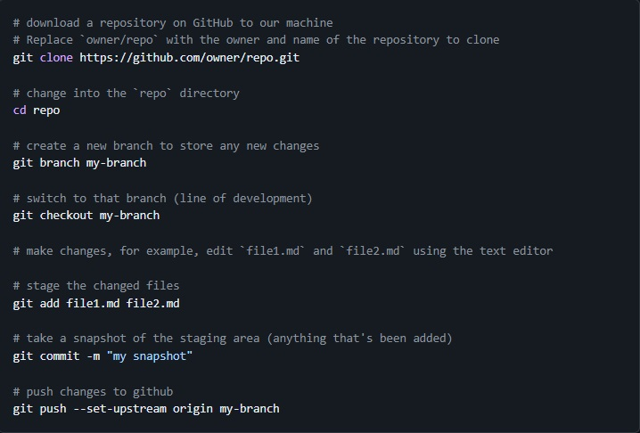

# Работа с удаленными репозиториями

```sh 
git clone — создает локальную копию проекта, который уже существует удаленно. Клон включает в себя все файлы проекта, журнал и ветви.
```
```sh
git pull — применяет к локальной линии разработки обновления из удаленного аналога. Разработчики используют эту команду, если коллега выполнил фиксации в ветви удаленного репозитория и эти изменения нужно отразить в локальной среде.
```
```sh
git push — обновляет удаленный репозиторий с учетом фиксаций, выполненных в ветви локально.
```
## Пример работы с удаленным репозиторием


